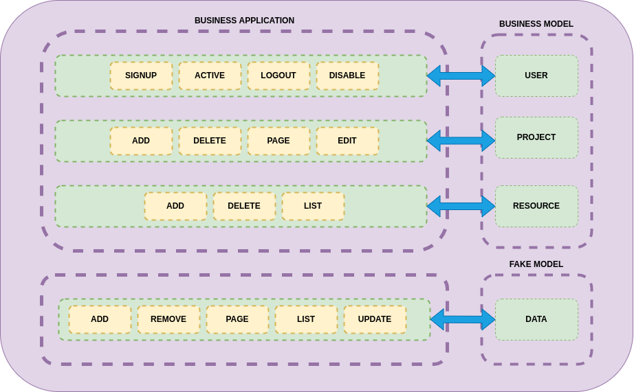

<h2 style="margin:0">WIP</h2>

<i>Updating readme as soon as possible &#9786;</i> 

 

    <h1>Fake-end API</h1>

## :dart: Application purpose

The <i>Fake-end API</i> is an application that was designed for <strong>front-end</strong> developers. Why? Well, because you can create your interface and intregate with <i>Fake-end API</i> easly.

How you can do this? First you will need to create an account in our application, after that you will be able to create an project and inside this project you will be able to create some resources, for instance: 
    <blockquote>
        James is a front-end developer and need create an simple SPA that contains a list of to do (classic).
        In this case James will signIn in <i>Fake-end API</i> and will create a project called <strong>"To Do List"</strong>. 
        Ok, after that, James will need to create a resource for their to do's. So he will create a resource called <strong>"to-do"</strong>.  
        After James create all that, the <i>Fake-end API</i> will provide some end points and a secretKey that James can use, for example:
        <ul>
            <li>to-do/list-all (GET METHOD)</li>
            <li>to-do/page (GET METHOD)</li>
            <li>to-do/edit/{id} (PUT METHOD)</li>
            <li>to-do/save (POST METHOD)</li>
        <ul>
    </blockquote>

## :computer: Technologies

## :wrench: Architecture fluxogram

## :dart: Developer purpose

 
    I see some business without time to create prototypes to validate some applications or freelancers that need to validate with their clients some part of an application that is not ready yet.
    Next to that, I saw an opportunity to improve my skills about <strong>Clean code, Clean Architecture and TDD.</strong> 

#### :man: Author

 
  
  
   
 

